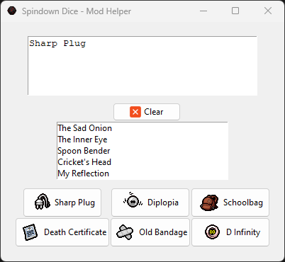

# The Binding of Isaac: Repentace - Spindown Dice in-game Mod

**Idea**: in-game Spindown Dice visualizer:
1. Inside the companion app (`resources/main.py` that has to be run from the home directory) choose an Item
2. Inside the game press `F1` to see the number of spins needed to go down to the chosen item

It's important to run the game with the flag `--luadebug` since it's required to read the files that are used from the mod and the companion to communicate.

## Companion app

In the first TextBox, write the name of an item until it appears in the list under the `Clear` button, then click it (the click is necessary for it to be updated in the game). Some items have a dedicated button since they are the most searched.

## In game visualizer

On the left part, the selected Item can be seen right under the stats. Remember that everything is shown while `F1` is pressed

Values that can be seen on an item:

- `X`, where `X` is the number of spins needed to go down to the chosen item
- `NO`, when the selected item is not reachable with any number of spins (the id of the target is higher than the id of the in-game item)
- `DN`, when *Dad's Note* is on the way, and it blocks the spinning
- `CB`, when due to *Car Battery* the selected item is skipped

Some examples:

