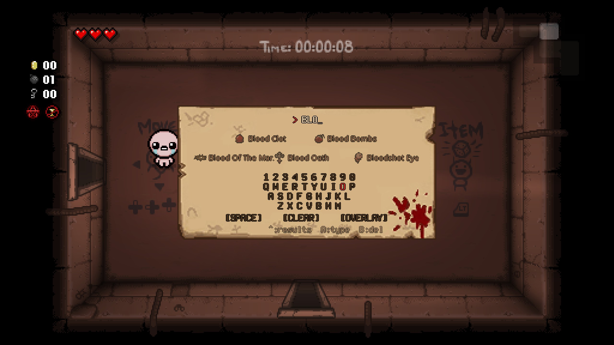
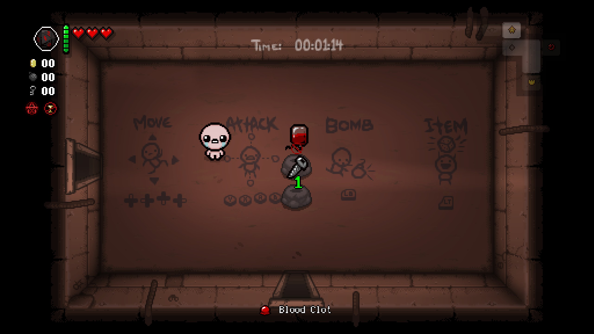
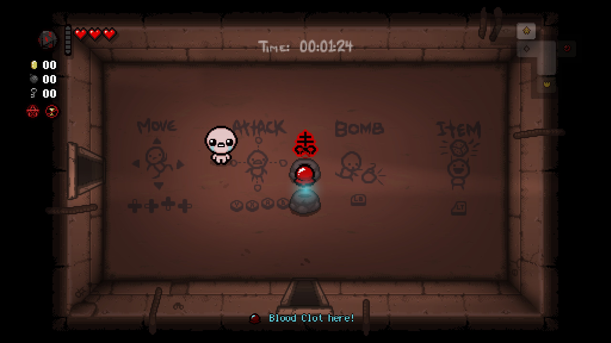
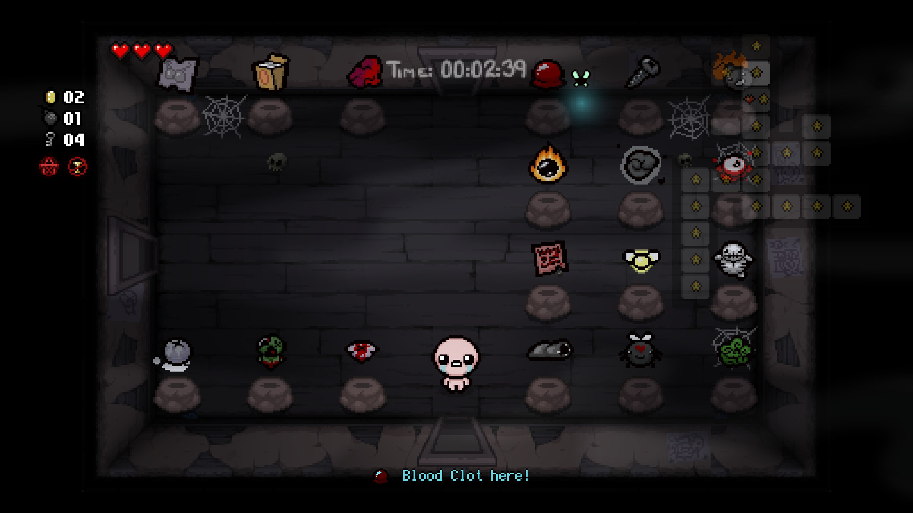

# Spindown Helper In-Game

In-game mod for [_The Binding of Isaac: Repentance_](https://store.steampowered.com/app/1426300/The_Binding_of_Isaac_Repentance/) that shows how many Spindown Dice spins are needed to reach a desired item, and helps locate items on the Death Certificate floor.

Written in [TypeScript](https://www.typescriptlang.org/) using [IsaacScript](https://isaacscript.github.io/).

## Features

- **Virtual keyboard**; search and select any collectible item by name
- **Pedestal overlays**; spin counts, reachability indicators, and color-coded distance shown above every pedestal in the room
- **Item found halo + jingle**; a glowing halo marks the pedestal when the selected item is found in the current room, accompanied by a secret-room-found chime
- **Death Certificate familiar**; a Yo Listen? familiar flies toward the target item on the Death Certificate floor, drawn with a trailing halo
- **Car Battery support**; double-spin steps are computed automatically and displayed
- **Hidden / locked item filtering**; items that cannot be reached (hidden, locked, or blocked by Dad's Note) are correctly excluded

## How to Use

### Open the keyboard

Double-tap the **Map button** (`Tab` on keyboard, Select on controller) to open the virtual keyboard. Double-tap again to close it.

While the keyboard is open, the player's controls are disabled.

### Search for an item

| Control | Action |
|---|---|
| Arrow keys / D-pad | Navigate the letter grid |
| Confirm / Item button | Type the highlighted letter |
| Back / Bomb button | Delete the last character |
| `[SPACE]` | Type a space |
| `[CLEAR]` | Clear the selected item and close |
| `[OVERLAY]` | Toggle the overlay on/off and close (glows gold when active) |

As you type, up to 5 matching items appear above the keyboard:
- The top row shows results 4–5 (if any)
- The bottom row shows results 1–3

Push **Up** from the keyboard grid to enter the results area, then use **Left/Right** to navigate and **Confirm** to select an item. Push **Down** from the results to return to the keyboard.

When the search is empty, five favorites are shown by default (only those that are unlocked): **Death Certificate**, **Diplopia**, **Glitched Crown**, **Sharp Plug**, and **D Infinity**.



### Read the overlay

Once an item is selected and the overlay is on, every collectible pedestal in the room shows an indicator above it. **Spindown Dice must be equipped** in one of your active slots (primary, secondary, or pocket) for the overlay to display; otherwise only the bottom HUD is shown.

| Indicator | Meaning |
|---|---|
| `1`, `2`, `3`… | Spins needed (color fades from green to red-orange with distance) |
| ⃠| Unreachable; target ID is equal or higher, target is hidden/locked, or too many items are skipped |
| ⃠  over Car Battery | Unreachable with **Car Battery** (odd step count is doubled, making it unreachable) |
| ⃠  over Dad's Note | **Dad's Note** on the path; Spindown would land on Dad's Note instead |

Unreachable items show a red "prohibited" sprite (red circle with diagonal line). When the cause is Car Battery or Dad's Note, their item sprites appear underneath as a hint.

The selected item's sprite and name are also displayed in the bottom HUD at the center of the screen.



### Item found (halo + jingle)

When the selected item is physically present on a pedestal in the room:

- A **white animated halo** appears above that pedestal
- The **secret room found jingle** plays
- The bottom HUD changes from `"Item Name"` to `"Item Name here!"` in aqua-blue text

There is a brief 15-frame delay after entering a new room or hearing the jingle before any indicators appear, giving you a moment to orient yourself.



### Death Certificate floor

When inside the Death Certificate area:

- The overlay switches from spin-count mode to **item-finding mode**
- If the target item is locked, the bottom HUD simply shows the item name
- If the target item is unlocked and present in the current room:
  - A **"Item Name here!"** message appears in aqua-blue at the bottom
  - A **Yo Listen? familiar** (with a trailing halo) spawns from your position and flies toward the item, then orbits around it
  - The **secret room found jingle** plays on entering the correct room

If the item is not in the current room, the familiar resets and only the item name is shown.

All cached per-room for performance.



## Build

```bash
npm ci           # install dependencies
npm start        # launch the IsaacScript monitor (auto-recompiles on changes)
```

Copy or symlink the `mod/` folder into your Isaac mods directory (`/mods/spindown-helper-ingame/`).
