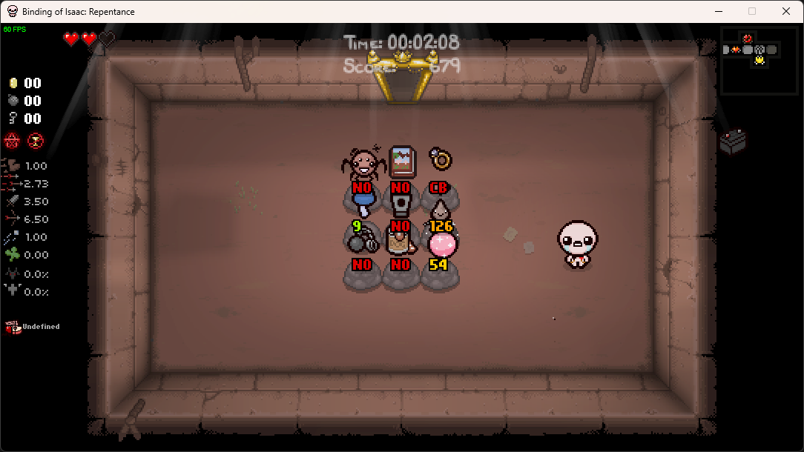
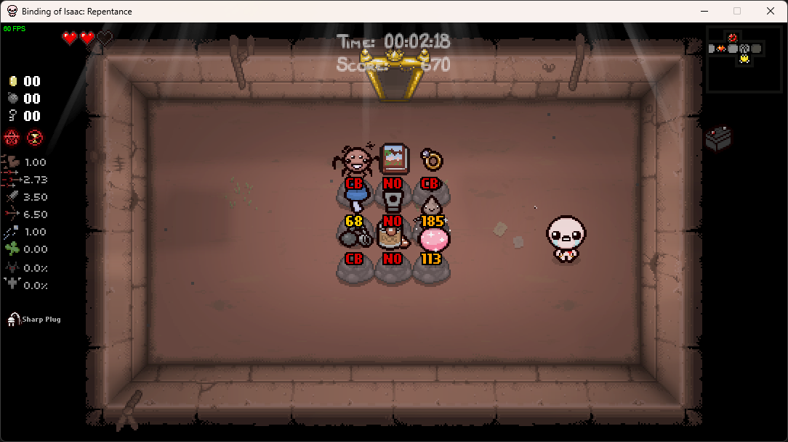

# Spindown Helper In-Game

In-game mod for [_The Binding of Isaac: Repentance_](https://store.steampowered.com/app/1426300/The_Binding_of_Isaac_Repentance/) that shows how many Spindown Dice spins are needed to reach a desired item — no external companion app required.

Written in [TypeScript](https://www.typescriptlang.org/) using [IsaacScript](https://isaacscript.github.io/).

## How to Use

### Select a target item

Double-tap the **Map button** (`Tab` on keyboard, Select on controller) to open the in-game virtual keyboard:

- **Arrow keys / D-pad** — move the cursor across the letter grid
- **Confirm / Item button** — type the highlighted letter
- **Back / Bomb button** — delete the last character
- **`[SPACE]`** — type a space
- **`[CLEAR]`** — clear the selected item and close
- **`[OVERLAY]`** — toggle the overlay on/off and close (glows gold when active)

As you type, up to 3 matching items appear above the keyboard. Push **Up** to enter the results row, then **Left/Right** to navigate between matches. Press **Confirm** to select one.

When the search is empty, three favorites are shown by default: **Death Certificate**, **Diplopia**, and **Glitched Crown**.

Double-tap **Map** again to close the keyboard.

### View spin counts

Once an item is selected and the overlay is on (via `[OVERLAY]` or by selecting a result), every collectible pedestal in the room shows a label above it:

| Indicator | Meaning |
|-----------|---------|
| `X` | Number of Spindown Dice spins to reach the target (color-coded by distance: green → yellow-green → yellow → orange → red-orange) |
| ⃠ | Unreachable — target ID is equal or higher, or blocked by a hidden item |
| ⃠ over Car Battery | Skipped due to **Car Battery** (odd step count doubled, unreachable) |
| ⃠ over Dad's Note | **Dad's Note** on the path — Spindown would land on Dad's Note instead |

Unreachable items show a "prohibited" sprite (red circle with diagonal line) instead of text. When the cause is Car Battery or Dad's Note, their respective item sprites appear underneath the prohibited overlay.

The selected item is also shown in the bottom HUD (sprite + name) at the center of the screen.

### Death Certificate

When inside the Death Certificate floor, the mod stops showing spin counts and instead helps you find the room containing your selected item:

- **"Item here!"** text appears on screen
- A **dotted green line** draws from your position to the item (after a short delay)
- A **Holy Card sound** plays when you enter the correct room

## How to Compile

- Install [Node.js](https://nodejs.org/en/download/)
- Clone this repository
- Run `npm ci` to install dependencies
- Run `npm start` to launch the IsaacScript monitor (auto-recompiles on changes)
- Copy or symlink the `mod/` folder into your Isaac mods directory
